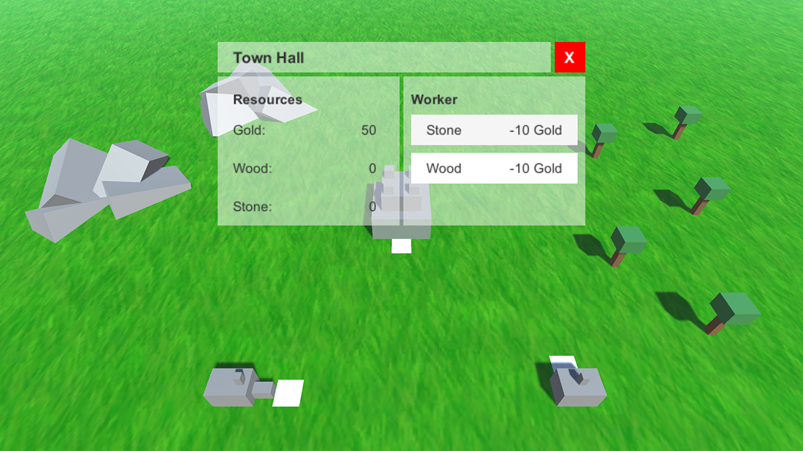
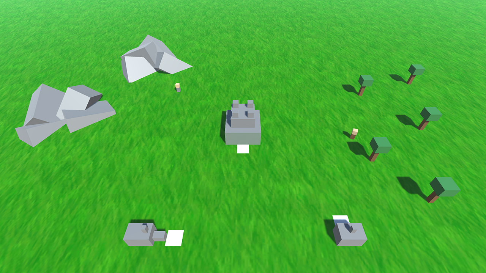
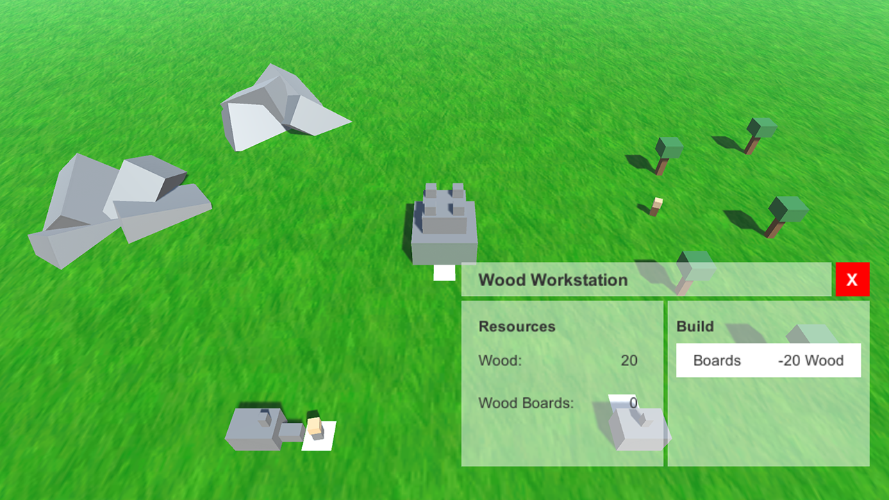

# Strategy-Game-Prototype
I created this prototype for an intership application.

This were the tasks i received:
### Resource Manager
- build a small strategy game with a resource gathering system and a refinement workstations
### Passiv Workers
- you chose how much Stone or Wood you want to get
- building them costs resources
### The Minions are now searching for (wood or stone) and bring them to the Refinement Buildings (Entrypoint)
- Stone to Marmor
- Wood to Wood Boards
### Buildings can change material in X sec from X to Y amount
### Buildings have an Entrypoint to receive materials

## Screenshots  
  
  
  

